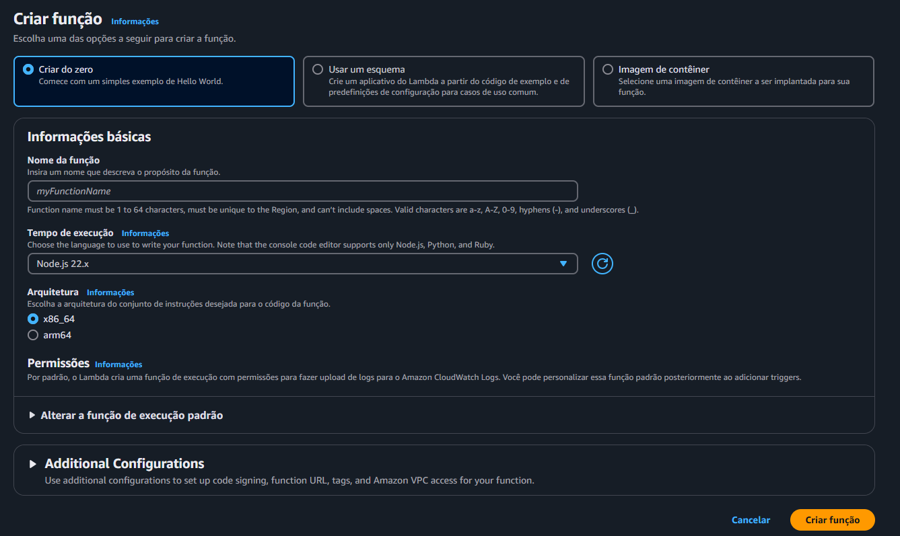
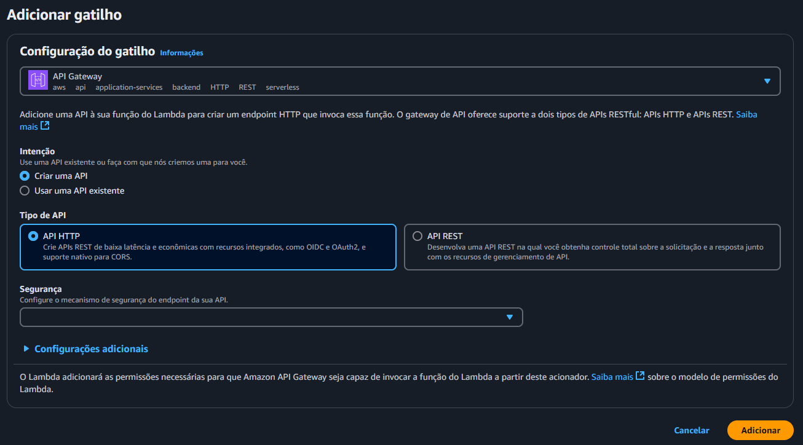
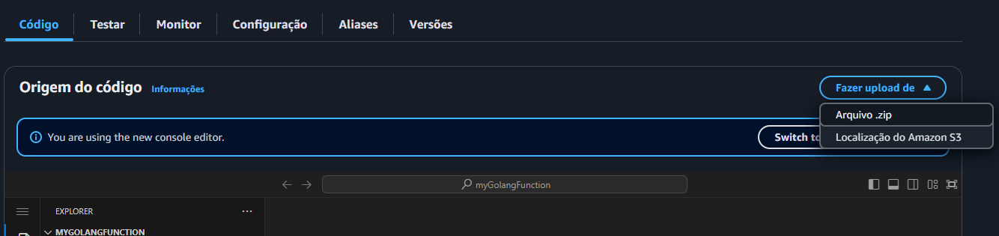
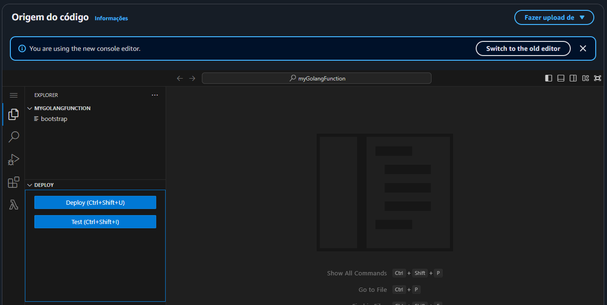
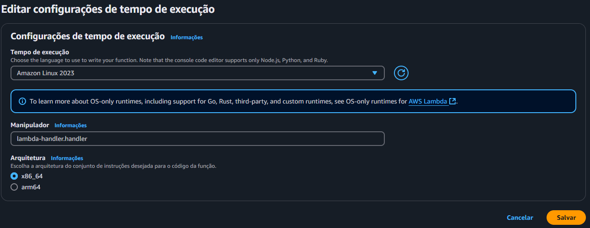

# AWS Lambda [](https://skillicons.dev)
O AWS Lambda é um serviço de computação serverless oferecido pela Amazon Web Services (AWS) que permite executar código sem a necessidade de gerenciar servidores. Ele segue um modelo baseado em eventos, onde o código é executado em resposta a eventos específicos, como mudanças em dados em um bucket do Amazon S3, atualizações em um banco de dados DynamoDB, mensagens em filas (SQS), solicitações HTTP via API Gateway, entre outros.

## Características  e Vantagens

- **Serverless:** Não é necessário provisionar ou gerenciar servidores. A AWS cuida da infraestrutura e da escalabilidade automaticamente.

- **Baseado em Eventos:** Executa funções em resposta a eventos gerados por outros serviços AWS ou fontes externas.

- **Execução Sob Demanda:** Você só paga pelo tempo em que seu código está em execução, em incrementos de milissegundos, e pela quantidade de solicitações.

- **Suporte a Vários Idiomas:** Suporta várias linguagens de programação, como Python, JavaScript (Node.js), Java, C#, Go, Ruby e outros. Também é possível executar linguagens adicionais usando runtimes personalizados.

- **Escalabilidade Automática:** Escala automaticamente com base no número de eventos, sem a necessidade de configuração manual.

- **Integração com outros Serviços AWS:** Funciona bem com diversos serviços AWS, como S3, DynamoDB, API Gateway, SQS, SNS, e muitos outros.

- **Custo-efetivo:** para aplicações com demandas variáveis.

- **Rápido desenvolvimento:** com menos preocupações com a infraestrutura.

- **Alta disponibilidade:** embutida sem configurações adicionais.

## Exemplo Lambda NodeJS
Para criar uma Lambda Function você pode acessar o painel inicial da AWS e pesquisar por Lambda e selecionar. Clicar em criar função, manter a opção de **criar do zero**, adicionar o nome da sua função, o tempo de execução com a versão do **Node.js 22.x**, arquitetura **x86_64**, e selecionar **Criar função**.


Adicione um gatilho selecionando a opção **API Gateway**, que criar-a um endereço para que voce realize requisições.


Insira seu código tendo em mente que, por padrão as Lambdas executam a função nomeada como **handler**
, por exemplo:

```js
export const hanlder = async (event, context) => {
    // event seria sua request
    // context seria o trace da operação
    
    const response = {
        statusCode: 200,
        body: JSON.stringify("Hello World!"),
    };

    return response;
};
```
Selecione a aba de **Configurações** e encontre o **Endpoint da sua API Gateway**, selecione ou execute uma requisição POST usando este endereço.

## Exemplo Lambda Golang
Para criar uma Lambda Function você pode acessar o painel inicial da AWS e pesquisar por Lambda e selecionar. Clicar em criar função, manter a opção de **criar do zero**, adicionar o nome da sua função, o tempo de execução com a versão do **Amazon Linux 2023**, arquitetura **x86_64**, e selecionar **Criar função**. Diferente do NodeJS, para criar uma Lambda usando Golang você deve utilizar um arquivo **.zip** com os binários da sua aplicação, então vamos cria-la.

Abra seu terminal na pasta em que deseja criar sua aplicação e execute:

Para iniciar a aplicação:
```shell
go mod init myGolamgLambda
```

Instalar a dependência para zipar o build:
```shell
go.exe install github.com/aws/aws-lambda-go/cmd/build-lambda-zip@latest
```
Instalar as dependências da AWS para Go:
```shell
go get github.com/aws/aws-lambda-go/events
```

```shell
go get github.com/aws/aws-lambda-go/lambda
```

Crie seu arquivo **main.go** com sua função main e sua função handler:
```go
package main

import (
	"fmt"

	"github.com/aws/aws-lambda-go/events"
	"github.com/aws/aws-lambda-go/lambda"
)

func handler(request events.APIGatewayProxyRequest) (response events.APIGatewayProxyResponse, err error) {
	fmt.Println("Hello World!")

	response = events.APIGatewayProxyResponse{
		StatusCode: 200,
		Body:       "Hello World!",
	}

	return response, err
}

func main() {
	lambda.Start(handler)
}
```

Configure as variáveis de ambiente para trabalhar com sistema operacional Linux, arquitetura AMD x86_64, faça o build e crie o zip.

Linux:
```bash
GOOS=linux GOARCH=amd64 go build -o bootstrap main.go
zip lambda-handler.zip bootstrap
```

Windows cmd:
```cmd
set GOOS=linux
set GOARCH=amd64
set CGO_ENABLED=0
go build -o bootstrap main.go
%USERPROFILE%\Go\bin\build-lambda-zip.exe -o lambda-handler.zip bootstrap
```

Windows Powershell:
```powershell
$env:GOOS = "linux"
$env:GOARCH = "amd64"
$env:CGO_ENABLED = "0"
go build -o bootstrap main.go
~\Go\Bin\build-lambda-zip.exe -o lambda-handler.zip bootstrap
```

Com sua aplicação desenvolvida e seu zip disponível, volta a sua página da AWS, na ába **Código** clique em **Fazer upload de** e selecione **Arquivo .zip**.


Seu navegador do Lambda deve ser como este:


O seu executável deve se chamar bootstrap obrigatóriamente, junto a sua configuração de tempo de execução que esta mais na ába **Código**, selecione editar e altere o nome do seu manipulador que deve ser "nome do zip".handler:


Sendo assim, você precisa apenar criar seu API Gateway como um gatilho da aplicação e executar seu endpoint semelhante ao que fizemos na Lambda do NodeJS.
